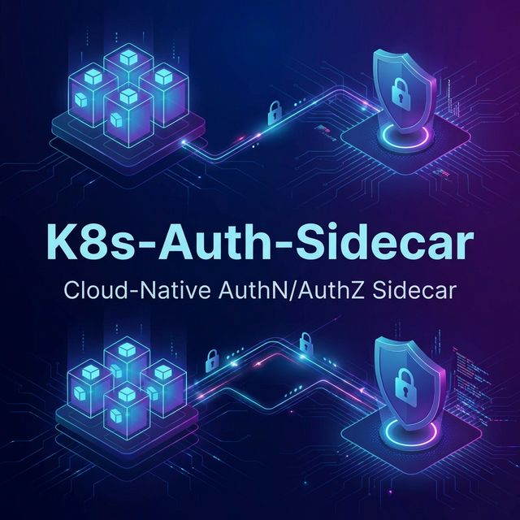
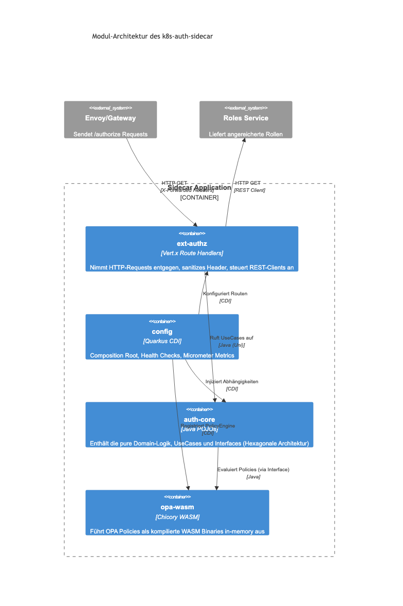

<div align="center">
  
</div>

# K8s-Auth-Sidecar - AuthN/AuthZ Sidecar für Kubernetes

[](https://quarkus.io)
[](https://openjdk.org)
[](LICENSE)

**K8s-Auth-Sidecar** (Request Router Sidecar) ist ein Quarkus-basierter Microservice, der als Sidecar in Kubernetes-Pods läuft und Authentifizierung (AuthN) sowie Autorisierung (AuthZ) für den Haupt-Container übernimmt – ähnlich wie Cerbos oder OPA.

## 🏗️ Architektur



## 🧠 Funktionsweise im Detail

### 1. Wer liefert welche Daten?

| Komponente | Verantwortung | Beispiel-Daten |
|------------|---------------|----------------|
| **Client** | Authentifizierung | JWT Token (`Authorization: Bearer ...`) |
| **Identity Provider**<br>(Keycloak / Entra ID) | **Identität & grobe Rollen**<br>Bestätigt, wer der User ist. | `sub: "user-123"`<br>`email: "max@space.maatini"`<br>`roles: ["user"]` |
| **Roles Service**<br>(Externer Microservice) | **Feingranulare Rechte**<br>Ergänzt applikationsspezifische Berechtigungen, die nicht im Token stehen. | `roles: ["project-admin"]`<br>`permissions: ["delete:reports"]`<br>`tenant: "project-x"` |
| **OPA Policy**<br>(Rego Datei) | **Das Regelwerk**<br>Definiert die Logik, wer was darf. | *"Wenn User Rolle 'admin' hat und Pfad '/admin' ist -> ERLAUBEN"* |

### 2. Der Entscheidungs-Ablauf


Jeder Request durchläuft diese Pipeline:

1.  **🔍 Token Validierung**: Ist das JWT gültig? (Signatur, Ablaufdatum, Issuer).
    *   *Fehler:* `401 Unauthorized`
2.  **➕ Enrichment**: Der Sidecar fragt den **Roles Service**: *"Was darf dieser User noch?"*.
    *   Die Antwort wird für kurze Zeit im Cache gespeichert, um schnell zu bleiben.
3.  **⚖️ Policy Check**: Der Sidecar baut ein Input-JSON (User + Request + Rollen) und fragt die **OPA-Engine**.
    *   *Input:* `{"user": {"roles": ["user", "admin"]}, "request": {"method": "DELETE"}}`
    *   *Policy:* `allow { input.user.roles[_] == "admin" }`
    *   *Ergebnis:* `true` oder `false`.
4.  **🚀 Proxy**:
    *   **Erlaubt:** Request wird an deine Applikation (Port 8081) weitergeleitet. Auth-Infos werden als Header (`X-Auth-User-Roles`) angehängt.
    *   **Verboten:** User erhält sofort `403 Forbidden`. Deine App wird gar nicht erst belästigt.

### 3. Wie werden Regeln aktualisiert?

Du musst den Sidecar **nicht neu starten**, um Regeln zu ändern!

*   **Embedded Mode (Standard):**
    1.  Regeln liegen in einer Kubernetes **ConfigMap** (`k8s-auth-sidecar-policies`).
    2.  Du änderst die Regel in der ConfigMap (`kubectl edit` oder GitOps).
    3.  Kubernetes aktualisiert die Datei im Pod.
    4.  Der Sidecar bemerkt die Änderung und lädt die neuen Regeln **automatisch (Hot Reload)**.
    5.  Die Änderung ist in wenigen Sekunden aktiv.

## ✨ Features

- **Multi-Tenant OIDC-Support**: Keycloak und Microsoft Entra ID (Azure AD)
- **Flexible Policy-Engine**: Eingebettete OPA-Regeln oder externer OPA-Server
- **Rollen-Enrichment**: Integration mit externem Roles/Permissions-Service
- **Reaktive Pipeline**: Non-blocking AuthN → Enrichment → AuthZ Verarbeitung
- **Zero-Trust**: Jede Anfrage wird validiert
- **Zentrales Path-Matching**: Ant-Style Patterns (`/**`, `/*`) über `PathMatcher`-Utility
- **Observability**: Prometheus Metrics, JSON Logging, OpenTelemetry
- **Sicherer Lifecycle**: Ordnungsgemäße Ressourcen-Freigabe (`@PreDestroy`) aller Clients
- **Native Image**: Support für GraalVM Native Image
- **Kubernetes-Ready**: Kustomize-basierte Deployment-Manifeste

## 🚀 Schnellstart

### Voraussetzungen

- Java 21+
- Maven 3.9+
- Docker (optional)
- Kubernetes Cluster (für Deployment)

### Lokale Entwicklung

```bash
# Projekt klonen
git clone https://github.com/maatini/k8s-auth-sidecar.git
cd k8s-auth-sidecar

# Dependencies herunterladen und kompilieren
mvn compile

# Im Dev-Modus starten
mvn quarkus:dev

# Tests ausführen
mvn test
```

### Docker Build

```bash
# JVM-Image bauen
docker build -t space.maatini/k8s-auth-sidecar:1.0.0 .

# Native Image bauen (dauert länger)
docker build -f Dockerfile.native -t space.maatini/k8s-auth-sidecar:1.0.0-native .
```

## ⚙️ Konfiguration

### Umgebungsvariablen

| Variable | Beschreibung | Standard |
|----------|--------------|----------|
| `OIDC_AUTH_SERVER_URL` | Keycloak Auth-Server URL | `https://keycloak.example.com/realms/myrealm` |
| `OIDC_CLIENT_ID` | OIDC Client ID | `k8s-auth-sidecar` |
| `OIDC_CLIENT_SECRET` | OIDC Client Secret | - |
| `OIDC_TENANT_ENABLED` | Multi-Tenant aktivieren | `false` |
| `ENTRA_AUTH_SERVER_URL` | Entra ID Auth-Server URL | - |
| `ENTRA_CLIENT_ID` | Entra ID Client ID | - |
| `ROLES_SERVICE_URL` | URL des Roles-Microservice | `http://roles-service:8080` |
| `PROXY_TARGET_HOST` | Backend-Host | `localhost` |
| `PROXY_TARGET_PORT` | Backend-Port | `8081` |
| `OPA_ENABLED` | OPA-Policy-Evaluation aktivieren | `true` |
| `OPA_MODE` | `embedded` oder `external` | `embedded` |
| `OPA_URL` | Externer OPA-Server URL | `http://localhost:8181` |
| `QUARKUS_HTTP_CORS_ORIGINS` | Erlaubte CORS Origins | `*` (nur Dev!) |

### Vollständige Konfiguration

Siehe `src/main/resources/application.yaml` für alle Optionen.

## 📋 Policy-Konfiguration

Policies werden in Rego geschrieben und im `/policies`-Verzeichnis abgelegt.

### Beispiel-Policy

```rego
package authz

import future.keywords.if
import future.keywords.in

default allow := false

# Superadmin hat Zugriff auf alles
allow if {
    "superadmin" in input.user.roles
}

# Admin-Pfade nur für Admins
allow if {
    startswith(input.request.path, "/api/admin")
    "admin" in input.user.roles
}

# Lese-Zugriff für authentifizierte Benutzer
allow if {
    input.request.method == "GET"
    startswith(input.request.path, "/api/")
    role_match({"admin", "user", "viewer"})
}

# Schreib-Zugriff für User und Admins
allow if {
    input.request.method in ["POST", "PUT", "DELETE"]
    role_match({"admin", "user"})
}

# Helper-Funktion
role_match(required_roles) if {
    some role in input.user.roles
    role in required_roles
}
```

### Policy-Input-Struktur

```json
{
  "request": {
    "method": "GET",
    "path": "/api/users",
    "headers": { "X-Request-ID": "..." },
    "queryParams": { "limit": "10" }
  },
  "user": {
    "id": "user-123",
    "email": "user@example.com",
    "roles": ["user", "admin"],
    "permissions": ["read:users"],
    "tenant": "my-tenant"
  },
  "resource": {
    "type": "users",
    "id": null,
    "action": null
  }
}
```

## 🚢 Kubernetes Deployment

### Mit Kustomize

```bash
# Development
kubectl apply -k k8s/overlays/development

# Production
kubectl apply -k k8s/overlays/production
```

### Sidecar zu bestehendem Deployment hinzufügen

Füge den Sidecar-Container zu deinem Deployment hinzu:

```yaml
spec:
  containers:
    # Dein bestehender Container
    - name: my-application
      image: my-app:latest
      ports:
        - containerPort: 8081  # Interne Port

    # K8s-Auth-Sidecar hinzufügen
    - name: k8s-auth-sidecar
      image: space.maatini/k8s-auth-sidecar:1.0.0
      ports:
        - containerPort: 8080  # Externe Port
      env:
        - name: PROXY_TARGET_HOST
          value: "localhost"
        - name: PROXY_TARGET_PORT
          value: "8081"
        - name: OIDC_AUTH_SERVER_URL
          value: "https://keycloak.example.com/realms/myrealm"
      volumeMounts:
        - name: policies
          mountPath: /policies

  volumes:
    - name: policies
      configMap:
        name: my-app-policies
```

**Wichtig:** Der Service muss auf Port 8080 (Sidecar) zeigen, nicht auf den App-Port!

```yaml
apiVersion: v1
kind: Service
metadata:
  name: my-application
spec:
  ports:
    - port: 80
      targetPort: 8080  # -> Sidecar
```

## 📊 Monitoring

### Prometheus Metrics

Verfügbare Metriken unter `/q/metrics`:

```
# Authentifizierung
sidecar_auth_success_total
sidecar_auth_failure_total
sidecar_auth_duration_seconds

# Autorisierung
sidecar_authz_allow_total
sidecar_authz_deny_total

# Proxy
sidecar_proxy_requests_total
sidecar_proxy_errors_total
sidecar_proxy_duration_seconds
```

### Health Checks

```bash
# Liveness
curl http://localhost:8080/q/health/live

# Readiness
curl http://localhost:8080/q/health/ready
```

## 🔐 Sicherheit

### Token-Validierung

Der Sidecar validiert JWTs gegen den konfigurierten Identity Provider:

1. **Signatur-Prüfung**: Via JWKS-Endpoint
2. **Expiration-Check**: Token darf nicht abgelaufen sein
3. **Audience-Check**: Token muss für diese Anwendung ausgestellt sein
4. **Issuer-Check**: Token muss vom erwarteten IdP stammen

### Best Practices

- ✅ Secrets über Kubernetes Secrets einspeisen
- ✅ TLS für alle externen Verbindungen
- ✅ Policies nach Least-Privilege-Prinzip
- ✅ Audit-Logging aktivieren
- ✅ Rate-Limiting konfigurieren
- ✅ Non-Root Container ausführen
- ✅ CORS-Origins in Produktion einschränken (`QUARKUS_HTTP_CORS_ORIGINS`)

## 🧪 Testing

### Unit Tests

```bash
mvn test
```

### Test Coverage

Coverage-Report generieren:

```bash
mvn test -Dquarkus.jacoco.report=true
```

Der Report liegt dann unter `target/jacoco-report/index.html`.

### Integration Tests

```bash
mvn verify
```

### Policy-Tests

Policies können mit dem OPA-CLI getestet werden:

```bash
# OPA installieren
brew install opa

# Policy testen
opa eval -i input.json -d src/main/resources/policies/authz.rego 'data.authz.allow'

# Alle Regeln evaluieren
opa eval -i input.json -d src/main/resources/policies/ 'data.authz'
```

Beispiel `input.json`:
```json
{
  "request": {
    "method": "GET",
    "path": "/api/users"
  },
  "user": {
    "id": "user-123",
    "roles": ["user"]
  }
}
```

## 📁 Projektstruktur

```
k8s-auth-sidecar/
├── docs/
│   └── ARCHITECTURE.md       # Architektur-Dokumentation
├── k8s/
│   ├── base/                 # Basis-Manifeste
│   └── overlays/             # Umgebungs-Overlays
├── src/
│   ├── main/
│   │   ├── java/space/maatini/sidecar/
│   │   │   ├── config/       # Konfiguration
│   │   │   ├── model/        # Datenmodelle
│   │   │   ├── service/      # Business-Logik
│   │   │   ├── filter/       # HTTP-Filter
│   │   │   ├── resource/     # REST-Endpoints
│   │   │   ├── client/       # REST-Clients
│   │   │   ├── health/       # Health-Checks
│   │   │   └── util/         # Utilities (PathMatcher)
│   │   └── resources/
│   │       ├── application.yaml
│   │       └── policies/     # OPA-Policies
│   └── test/
│       └── java/             # Tests
├── Dockerfile                # JVM-Image
├── Dockerfile.native         # Native-Image
├── pom.xml
└── README.md
```

## 🛠️ Erweiterung

### Eigene Policies hinzufügen

1. Rego-Datei in `/policies` erstellen
2. Hot-Reload ist aktiviert (bei `embedded` Mode)

### Eigene Claims verarbeiten

Den `AuthenticationService` erweitern:

```java
@ApplicationScoped
public class CustomAuthService extends AuthenticationService {
    @Override
    public AuthContext extractFromJwt(JsonWebToken jwt) {
        AuthContext base = super.extractFromJwt(jwt);
        // Eigene Claims hinzufügen
        return AuthContext.builder()
            .userId(base.userId())
            // ...
            .build();
    }
}
```

## 📄 Lizenz

Apache License 2.0 - siehe [LICENSE](LICENSE)

## 🤝 Contributing

Beiträge sind willkommen! Bitte lies zuerst die [CONTRIBUTING.md](CONTRIBUTING.md).

---

**Entwickelt von [space.maatini](https://github.com/maatini)**
