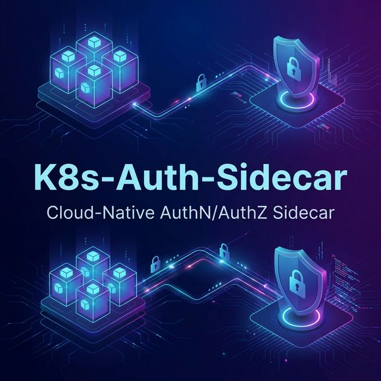

<div align="center">
  
</div>

# K8s-Auth-Sidecar - AuthN/AuthZ Sidecar für Kubernetes

[](https://quarkus.io)
[](https://openjdk.org)
[](LICENSE)

**K8s-Auth-Sidecar** (Request Router Sidecar) ist ein Quarkus-basierter Microservice, der als Sidecar in Kubernetes-Pods läuft und Authentifizierung (AuthN) sowie Autorisierung (AuthZ) für den Haupt-Container übernimmt – inklusive dynamischem Rollen-Enrichment und blitzschneller lokaler Entwicklung.

## ✨ Features

- ⚡ **Blitzschnelle lokale Entwicklung**: Out-of-the-Box Mocking für Identity Provider (Keycloak/Entra) und Roles Service via WireMock.
- 🏢 **Multi-Tenant OIDC-Support**: Standardisiert für Keycloak und Microsoft Entra ID (Azure AD).
- 🧠 **Flexible Policy-Engine**: Eingebettete OPA-WASM-Engine (Chicory, In-Memory) mit Hot-Reload oder externer OPA-Server.
- ➕ **Rollen-Enrichment**: Nahtlose Integration mit externem Roles/Permissions-Service.
- ⚡ **Reaktive Pipeline**: Vollständig non-blocking AuthN → Enrichment → AuthZ Verarbeitung mit Mutiny `Uni`.
- 🛡️ **Zero-Trust**: Jede Anfrage wird validiert.
- 📡 **Streaming Proxy**: Request-Bodies werden **nie** vollständig in den RAM geladen – echtes Vert.x Streaming für beliebig große Payloads.
- 🔐 **IP-Spoofing-Schutz**: Rate-Limiting mit Trusted-Proxy-Konfiguration und Caffeine-Cache gegen Memory Leaks.
- 🎯 **Zentrales Path-Matching**: Ant-Style Patterns (`/**`, `/*`) über praktisches `PathMatcher`-Utility.
- ⚡ **High-Performance Caches**: Wiederholte JWT-Validierungen und Policies werden effizient in O(1) mit Caffeine gebuffert.
- 📊 **Observability**: Prometheus Metrics, JSON Logging und OpenTelemetry out-of-the-box.
- 🔒 **Sicherer Lifecycle**: Ordnungsgemäße Ressourcen-Freigabe (`@PreDestroy`) aller Clients.
- 🚀 **Native Image**: Voller Support für ressourcenschonende GraalVM Native Images.
- 🚢 **Kubernetes-Ready**: Kustomize-basierte Deployment-Manifeste.
- 🐳 **CVE-gehärtete Docker-Images**: Alpine-Pakete werden automatisch gepatcht, OPA-CLI v1.x vorinstalliert.

## 🚀 Lokale Entwicklung – In 60 Sekunden

Beschleunige deine lokale Entwicklung mit unserer vorkonfigurierten, magischen Dev-Umgebung. Alles, was du brauchst, ist out-of-the-box eingerichtet – dank dem dynamischen Quarkus `%dev` Profil und WireMock.

### Voraussetzungen
- Docker & Docker Compose
- JDK 21+ & Maven

### Schritt-für-Schritt

1. **Projekt klonen**
   ```bash
   git clone https://github.com/maatini/k8s-auth-sidecar.git
   cd k8s-auth-sidecar
   ```

2. **Mock-Infrastruktur starten (WireMock)**
   Startet lokal einen OIDC-Server (Port 8090) und einen Mock für den Roles Service (Port 8089).
   ```bash
   docker compose -f docker-compose.dev.yml up -d
   ```

3. **Sidecar im Dev-Modus starten**
   ```bash
   mvn compile quarkus:dev
   ```
   **Was passiert im Hintergrund?** Das `%dev`-Profil wird automatisch aktiviert und konfiguriert den Sidecar optimal für die lokale Entwicklung:
   - 🔌 **HTTP-Port**: Wechselt auf `8080`.
   - 🔑 **OIDC-Issuer**: Zeigt direkt auf den lokalen WireMock OIDC-Server (`http://localhost:8090/realms/master`).
   - 🧑‍💻 **Roles Service**: Verbindet sich automatisch mit dem lokalen WireMock Roles-Server (`http://localhost:8089`).
   - 🚀 **Caching**: Ist für Roles & Policies im Dev-Modus deaktiviert, damit du Änderungen sofort testen kannst.

4. **Einen Test-JWT abrufen**
   WireMock ist so vorkonfiguriert, dass er dir auf Knopfdruck ein gültiges, signiertes JWT für einen Test-User (`test-user-123`) ausstellt:
   ```bash
   export TOKEN=$(curl -s -X POST http://localhost:8090/realms/master/protocol/openid-connect/token | jq -r .access_token)
   ```
   *Test-Anfrage an den Sidecar:*
   ```bash
   curl -H "Authorization: Bearer $TOKEN" http://localhost:8080/api/v1/something
   ```

### 🛠️ Mocking anpassen (Mocks / Rollen ändern)

Du möchtest testen, wie sich der Sidecar bei einem anderen User oder mit anderen Rollen verhält?
- **OIDC/JWT-Token**: Die Mappings liegen unter `wiremock/oidc/mappings/`.
- **Rollen & Permissions**: Die Mappings liegen unter `wiremock/roles/mappings/`.

*(WireMock nutzt Request-Templating: Das Mapping `roles.json` liest z.B. automatisch die `userId` aus der aufgerufenen URL aus und fügt sie in die Response ein.)*

### 💡 Alternative ohne Docker: In-Memory Roles Service
Falls du Docker Compose lokal nicht nutzen möchtest, kannst du einen leichtgewichtigen Mock direkt im Sidecar-Code nutzen.
Erstelle dazu einfach folgende Klasse, die nur im `%dev`-Profil aktiv ist:

```java
package space.maatini.sidecar.client;

import io.quarkus.arc.profile.IfBuildProfile;
import io.smallrye.mutiny.Uni;
import jakarta.enterprise.context.ApplicationScoped;
import jakarta.enterprise.inject.Alternative;
import jakarta.annotation.Priority;
import org.eclipse.microprofile.rest.client.inject.RestClient;
import space.maatini.sidecar.model.RolesResponse;

import java.util.Set;

@Alternative
@Priority(1)
@ApplicationScoped
@RestClient
@IfBuildProfile("dev")
public class InMemoryRolesService implements RolesServiceClient {
    @Override
    public Uni<RolesResponse> getRoles(String userId) {
        return Uni.createFrom().item(
            new RolesResponse(userId, Set.of("developer"), Set.of("read:all"), "tenant-A")
        );
    }
    }
    // Implementiere die anderen Interface-Methoden identisch...
}
```

---

## 🐳 Docker Compose Demo-Projekt (Sidecar in Action)

Möchtest du den Sidecar **komplett mit Dummy-Apps** gefeuert sehen, ohne Kubernetes zu benötigen? Wir haben einen kompletten Demo-Stack (`docker-compose.demo.yml`) gebaut.

Er beinhaltet:
1. Einen **Dummy-Backend-Service** (`traefik/whoami`), der alle empfangenen HTTP-Headers anzeigt. Dieser Service ist von außen **nicht** erreichbar.
2. Einen **OIDC Identity Provider** (gemockt via WireMock auf Port `8090`).
3. Einen **Roles Microservice** (gemockt via WireMock auf Port `8089`).
4. Den **K8s-Auth-Sidecar** (Port `8080`), der Anfragen filtert und an den Backend-Service routet.

### Demo starten

```bash
docker compose -f docker-compose.demo.yml up -d --build
```

1. **Test-Token generieren:**
   ```bash
   export TOKEN=$(curl -s -X POST http://localhost:8090/realms/master/protocol/openid-connect/token | jq -r .access_token)
   ```

2. **Gesicherte Anfrage senden:**
   ```bash
   curl -H "Authorization: Bearer $TOKEN" http://localhost:8080/api/v1/something
   ```
   *Du wirst sehen, dass die Dummy-App deine injizierten Rollen als HTTP-Header (`X-Auth-User-Role`) empfängt!*

   > [!NOTE]
   > Wichtiger Hinweis zum Demo-Setup: Da WireMock in Version 3.3.1 bei jedem Start dynamisch einen neuen JWKS-Schlüsselbund (Public Keys) generiert, das zurückgegebene Mock-JWT aber statisch signiert ist, schlägt die OIDC-Signaturprüfung standardmäßig fehl. 
   > Um den Proxy-Flow und die OPA-Policies im Demo-Setup (`docker-compose.demo.yml`) dennoch testen zu können, ist die Token-Vaildierung hier vorübergehend deaktiviert (`AUTH_ENABLED="false"`). Im `%dev` Profil (`mvn quarkus:dev`) wird der Token jedoch weiterhin normal vom Quarkus OIDC-Client validiert!

---

## 🏗️ Architektur


## 🧠 Funktionsweise im Detail

### 1. Wer liefert welche Daten?

| Komponente | Verantwortung | Beispiel-Daten |
|------------|---------------|----------------|
| **Client** | Authentifizierung | JWT Token (`Authorization: Bearer ...`) |
| **Identity Provider**<br>(Keycloak / Entra ID) | **Identität & grobe Rollen**<br>Bestätigt, wer der User ist. | `sub: "user-123"`<br>`email: "max@space.maatini"`<br>`roles: ["user"]` |
| **Roles Service**<br>(Externer Microservice) | **Feingranulare Rechte**<br>Enrichment: Ergänzt applikationsspezifische Berechtigungen dynamisch. | `roles: ["project-admin"]`<br>`permissions: ["delete:reports"]`<br>`tenant: "project-x"` |
| **OPA Policy**<br>(Rego Datei) | **Das Regelwerk**<br>Definiert die finale Logik, wer was darf. | *"Wenn User Rolle 'admin' hat und Pfad '/admin' ist -> ERLAUBEN"* |

### 2. Der Entscheidungs-Ablauf


Jeder Request durchläuft diese Pipeline:
1. **🔍 Token Validierung**: Ist das JWT gültig? (Signatur via JWKS, Ablaufdatum, Issuer). *(Fehler: `401 Unauthorized`)*
2. **➕ Enrichment**: Der Sidecar fragt den **Roles Service**: *"Was darf dieser User noch?"*. (Die Antwort wird für kurze Zeit gecacht).
3. **⚖️ Policy Check**: Der Sidecar baut ein Input-JSON (User + Request + erweiterte Rollen) und fragt die **OPA-Engine**.
   - Input: `{"user": {"roles": ["user", "admin"]}, "request": {"method": "DELETE"}}`
   - Policy: `allow { input.user.roles[_] == "admin" }`
4. **🚀 Proxy**:
   - **Erlaubt:** Request wird an deine Applikation (z.B. Port 8081) weitergeleitet. Auth-Infos werden als Header (`X-Auth-User-Roles`) angehängt.
   - **Verboten:** User erhält sofort `403 Forbidden`. Deine App wird gar nicht erst belästigt.

### 3. Wie werden Regeln aktualisiert?
Du musst den Sidecar **nicht neu starten**, um OPA-Regeln zu ändern (bei `OPA_MODE=embedded`):
1. Regeln (.rego oder .wasm) liegen z.B. in einer Kubernetes **ConfigMap**.
2. Kubernetes aktualisiert die Datei im Pod bei Änderungen (atomarer Symlink-Swap auf `..data`).
3. Der Sidecar erkennt die Änderung **automatisch (Hot Reload)** – auch bei Kubernetes-typischen `..data`-Events – und lädt das neue WASM-Modul in wenigen Sekunden.

> [!TIP]
> Die Docker-Images enthalten die **OPA CLI v1.x** vorinstalliert. Bei `.rego`-Änderungen wird das WASM automatisch im Container rekompiliert – ohne externen Build-Schritt.

## ⚙️ Konfiguration

### Umgebungsvariablen

| Variable | Beschreibung | Standard |
|----------|--------------|----------|
| `OIDC_AUTH_SERVER_URL` | Keycloak Auth-Server URL | `https://keycloak.example.com/realms/myrealm` |
| `OIDC_CLIENT_ID` | OIDC Client ID | `k8s-auth-sidecar` |
| `OIDC_CLIENT_SECRET` | OIDC Client Secret | - |
| `OIDC_TENANT_ENABLED` | Multi-Tenant aktivieren | `false` |
| `ENTRA_AUTH_SERVER_URL` | Entra ID Auth-Server URL | - |
| `ENTRA_CLIENT_ID` | Entra ID Client ID | - |
| `ROLES_SERVICE_URL` | URL des externen Roles-Microservice | `http://roles-service:8080` |
| `PROXY_TARGET_HOST` | Backend-Host (App Container) | `localhost` |
| `PROXY_TARGET_PORT` | Backend-Port (App Container) | `8081` |
| `PROXY_TARGET_POOL_SIZE` | Maximale parallele HTTP-Connections zum Backend | `100` |
| `OPA_ENABLED` | OPA-Policy-Evaluation aktivieren | `true` |
| `OPA_MODE` | `embedded` (internes WASM) oder `external` | `embedded` |
| `OPA_WASM_PATH` | Pfad zur OPA-WASM-Datei (nur `embedded`) | `classpath:policies/authz.wasm` |
| `OPA_URL` | Externer OPA-Server URL (nur `external`) | `http://localhost:8181` |
| `QUARKUS_HTTP_CORS_ORIGINS` | Erlaubte CORS Origins | `*` (nur Dev!) |
| `RATE_LIMIT_ENABLED` | Rate-Limiting aktivieren | `false` |
| `RATE_LIMIT_RPS` | Requests pro Sekunde | `100` |
| `RATE_LIMIT_BURST` | Burst-Größe | `200` |
| `RATE_LIMIT_TRUSTED_PROXIES` | Trusted Proxy IPs (kommasepariert) | `127.0.0.1,::1` |

> [!IMPORTANT]
> **IP-Spoofing-Schutz**: Der `RateLimitFilter` wertet `X-Forwarded-For` / `X-Real-IP` Header **nur dann** aus, wenn die TCP-Remote-Adresse des Aufrufers in `trusted-proxies` steht. In Kubernetes muss hier die IP des Ingress-Controllers oder Load-Balancers eingetragen werden, z.B.:
> ```yaml
> sidecar:
>   rate-limit:
>     enabled: true
>     trusted-proxies: 10.244.0.1,10.244.0.2  # Ingress NGINX Pod IPs
> ```
> Ohne korrektes Setzen wird jeder Client-Request anhand seiner echten TCP-IP limitiert (sicherste Variante).

*Siehe `src/main/resources/application.yaml` für alle Konfigurationsmöglichkeiten inkl. des neuen `%dev` Profils.*

### Resilience / Fault Tolerance für Roles-Service (Edeka-Retail)

Um bei temporären Ausfällen des zentralen Edeka-Roles-Services (z.B. während Datenbank-Migrationen oder Lastspitzen) die Produktionsstabilität zu gewährleisten, wurde eine robuste Fault-Tolerance-Schicht (via SmallRye Fault Tolerance) auf Basis von `@Retry`, `@CircuitBreaker`, `@Timeout` und `@Fallback` integriert.

Diese ist primär für die Anforderungen des Edeka-Retail-Umfelds (z.B. Kassen-Checkouts, Hochverfügbarkeit) optimiert und vollständig konfigurierbar:

| Property | Environment Variable | Default | Erklärung für Retail-Defaults |
| :--- | :--- | :--- | :--- |
| `auth.roles-service.fault-tolerance.retry.max-retries` | `ROLES_SERVICE_RETRY_MAX` | `3` | Fängt kurze Netzwerkrüttler sicher ab. |
| `auth.roles-service.fault-tolerance.retry.delay` | `ROLES_SERVICE_RETRY_DELAY` | `400` (ms) | Gibt dem Backend genug Verschnaufpause zwischen Retries. |
| `auth.roles-service.fault-tolerance.retry.jitter` | `ROLES_SERVICE_RETRY_JITTER` | `150` (ms) | `150ms` Jitter verhindert das "Thundering Herd"-Problem nach Micro-Ausfällen. |
| `auth.roles-service.fault-tolerance.timeout` | `ROLES_SERVICE_TIMEOUT` | `1800` (ms) | Bei Hochlast (Weihnachtsgeschäft) ist ein Request nach 1,8s faktisch "tot" -> Fail-Fast! |
| `auth.roles-service.fault-tolerance.circuit-breaker.request-volume-threshold` | `ROLES_SERVICE_CB_VOLUME` | `8` | Der Circuit Breaker reagiert schnell auf Anomalien. |
| `auth.roles-service.fault-tolerance.circuit-breaker.failure-ratio` | `ROLES_SERVICE_CB_RATIO` | `0.4` | Bei 40% Fehlerquote auf 8 Aufrufe schützt der Breaker das Backend. |
| `auth.roles-service.fault-tolerance.circuit-breaker.delay` | `ROLES_SERVICE_CB_DELAY` | `8000` (ms) | 8 Sekunden Pause, bevor wieder getestet wird, ob das Backend "am Leben" ist. |

**Fallback-Strategie:** 
Schlägt der Service durch Exception, Timeout oder offenen Circuit-Breaker fehl, wird ein Fallback ausgelöst. Dieser gibt einen leeren Status aus bzw. gewährt die Basis-Edeka-Rolle (`offline-user`), sodass essenzielle Basiszugriffe (sofern durch OPA erlaubt) in Kassen-Notfallsituationen aufrechterhalten werden können.

> **Note:** Im `%dev` und `%test` Profil (z.B. bei der Nutzung von `InMemoryRolesService`) ist die Fault Tolerance global deaktiviert (`smallrye.faulttolerance.enabled=false`), um lokale Debugging-Loops nicht zu verfälschen.

## 📋 Policy-Konfiguration

Policies werden in Rego geschrieben und im `/policies`-Verzeichnis abgelegt.

### Beispiel-Policy

```rego
package authz

import future.keywords.if
import future.keywords.in

default allow := false

# Superadmin hat Zugriff auf alles
allow if {
    "superadmin" in input.user.roles
}

# Admin-Pfade nur für Admins
allow if {
    startswith(input.request.path, "/api/admin")
    "admin" in input.user.roles
}

# Lese-Zugriff für authentifizierte Benutzer
allow if {
    input.request.method == "GET"
    startswith(input.request.path, "/api/")
    role_match({"admin", "user", "viewer"})
}

# Helper-Funktion
role_match(required_roles) if {
    some role in input.user.roles
    role in required_roles
}
```

### Policy-Input-Struktur (JSON)
```json
{
  "request": {
    "method": "GET",
    "path": "/api/users",
    "headers": { "X-Request-ID": "..." }
  },
  "user": {
    "id": "user-123",
    "email": "user@example.com",
    "roles": ["user", "admin"],
    "permissions": ["read:users"],
    "tenant": "my-tenant"
  }
}
```

## 🚢 Kubernetes Deployment

### Mit Kustomize

```bash
kubectl apply -k k8s/overlays/development
kubectl apply -k k8s/overlays/production
```

### Sidecar zu bestehendem Deployment hinzufügen

```yaml
spec:
  containers:
    # 1. Deine bestehende Applikation
    - name: my-application
      image: my-app:latest
      ports:
        - containerPort: 8081  # Interner Port

    # 2. Den K8s-Auth-Sidecar hinzufügen
    - name: k8s-auth-sidecar
      image: ghcr.io/maatini/k8s-auth-sidecar:0.3.0
      ports:
        - containerPort: 8080  # Externer Port (auf den der Service zeigt!)
      env:
        - name: PROXY_TARGET_PORT
          value: "8081"
        - name: OIDC_AUTH_SERVER_URL
          value: "https://keycloak.example.com/realms/myrealm"
      volumeMounts:
        - name: policies
          mountPath: /policies

  volumes:
    - name: policies
      configMap:
        name: my-app-policies
```

**Wichtig:** Dein Kubernetes `Service` muss auf Port `8080` (Sidecar) routen, nicht direkt auf die App!

## 📊 Monitoring

**Prometheus Metrics** (unter `/q/metrics`):
- `sidecar_auth_success_total` / `sidecar_auth_failure_total`
- `sidecar_authz_allow_total` / `sidecar_authz_deny_total`
- `sidecar_proxy_requests_total` / `sidecar_proxy_errors_total`

**Health Checks**:
- Liveness: `curl http://localhost:8080/q/health/live`
- Readiness: `curl http://localhost:8080/q/health/ready`

## 🔐 Sicherheit & Performance

- **Token-Validierung & High-Speed Cache**: Signatur-Prüfung via JWKS, Expiration-Check, Issuer-Check – mit vorgeschaltetem, hochperformantem Caffeine-Cache, um redundante Kryptographieoperationen für bekannte Sessions zu umgehen.
- **Streaming Proxy**: Request-Bodies werden per Vert.x `sendStream()` weitergeleitet – kein `readAllBytes()` im gesamten Projekt. Auch 500 MB+ Payloads verursachen keinen Memory-Spike.
- **Reaktive Filter-Pipeline**: Der `AuthProxyFilter` ist vollständig non-blocking (`@ServerRequestFilter` + `Uni<Response>`), was den Durchsatz unter Last drastisch erhöht. Fallback-Error-Mechanismen allokieren Speicher in `O(1)`.
- **Rate-Limiting mit IP-Spoofing-Schutz**: `X-Forwarded-For`/`X-Real-IP` werden nur von konfigurierten `trusted-proxies` akzeptiert. Buckets nutzen einen größen- und zeitlimitierten Caffeine-Cache statt einer unbegrenzten `ConcurrentHashMap`.
- **CVE-gehärtete Container**: Alpine-Pakete werden via `apk upgrade` gepatcht, OPA-CLI ist auf v1.x aktualisiert (Go stdlib CVEs behoben).
- **Best Practices**:
  - ✅ Secrets über K8s Secrets einspeisen.
  - ✅ TLS für externe Verbindungen (Roles Service, IdP).
  - ✅ Audit-Logging am Sidecar aktivieren.
  - ✅ Trivy-Scan in CI-Pipeline für automatische Schwachstellen-Checks.

## 🚀 CI/CD & Releases

Das Projekt nutzt GitHub Actions für Continuous Integration und schnelles Deployment nach den höchsten Security-Standards:
- **CI Pipeline (`ci.yml`)**: Führt bei jedem PR und Push auf `main` Tests aus, generiert SBOMs, und testet die Kompilation im Dry-Run.
- **Release Pipeline (`release.yml`)**: Wird automatisch beim Pushen von Tags (z.B. `v0.1.0`) getriggert. Baut Release-Images (JVM und Native), befüllt OCI-Labels dynamisch und fügt **Signed Provenance & SBOMs (SLSA Level 3)** hinzu.
- **Intelligente Caching-Mechanismen**: Die Docker Native-Pipelines erkennen bereits in der CI übersetzte Binaries und überspringen redundante GraalVM-Kompilationen, was Deployments auf bis zu 10x Beschleunigung bringt.
- **Dependency Automation**: Dependabot & Renovate sorgen in Kombination für regelmäßige Security-Updates von Maven-Abhängigkeiten, Docker-Images und GitHub Actions (inkl. Auto-Merge für Minor/Patch-Updates).
- **Docker-Sicherheit**: Alle Images nutzen standardmäßig nicht-privilegierte User (`sidecar` bzw. UID `1001`), um **niemals als Root** zu laufen, und integrieren automatisch standardisierte OCI-Labels zur vollen Traceability.

## 🧪 Testing & Docker Build

### Unit & Integration Tests

Das Projekt verfügt über eine umfassende Test-Suite (**154 Tests**), die alle wesentlichen Aspekte der Anwendung abdeckt:

- **Unit-Tests**: Prüfen einzelne Klassen, rekordinhabende Utility-Methoden (`RequestUtils`, `IssuerUtils`, `PathMatcher`) und Service-Logik (`AuthenticationService`, `WasmPolicyEngine`).
- **Integrationstests (`@QuarkusTest`)**: Testen das Zusammenspiel der Komponenten, u.a. die JWT-Validierung (OIDC), externe Calls an den Roles Service und die Request-Filter-Pipeline.
- **Mocking (WireMock)**: 
  - `OidcWiremockTestResource` simuliert einen OIDC-Identity-Provider inkl. dynamischer JWT-Generierung.
  - `RolesServiceWiremockTestResource` mockt detailliert diverse Rollen- und Berechtigungs-Szenarien.
- **Testcontainers**: Werden für komplexe Integrationstests eingesetzt, z.B. um einen echten, externen OPA-Server hochzufahren und anzubinden.

**Aktuelle Testabdeckung (Code Coverage via JaCoCo):**
> [!NOTE]
> Die volle Testabdeckung wird nur erreicht, wenn Docker für die Integrationstests (Testcontainers) verfügbar ist.

- **Lines:** ~83.4% 
- **Instructions:** ~82.0%
- **Branches:** ~67.6%

*Wichtige Kernkomponenten wie der `AuthProxyFilter` (die Haupt-Pipeline) sind mit über 95% Line-Coverage exzellent abgedeckt.*

Du kannst die Tests und den Coverage-Report lokal wie folgt ausführen:

```bash
mvn test
mvn verify

# Coverage-Report generieren (target/jacoco-report/index.html)
mvn test -Dquarkus.jacoco.report=true
```

### OPA Policy Tests (Lokal - optional)
*(Hinweis: Der Sidecar benötigt die OPA-CLI zur Laufzeit nicht mehr, da er In-Memory WASM nutzt! Zum manuellen Testen von Policies ist die CLI jedoch hilfreich)*
```bash
brew install opa
opa eval -i input.json -d src/main/resources/policies/ 'data.authz.allow'
# Oder WASM kompilieren:
opa build -t wasm -e authz/allow -o src/main/resources/policies/authz.wasm src/main/resources/policies/
```

### Docker und Native Image Build
```bash
# Standard JVM-Image
docker build -t ghcr.io/maatini/k8s-auth-sidecar:0.3.0 .

# Leichtgewichtiges Native Image (GraalVM, dauert länger)
docker build -f Dockerfile.native -t ghcr.io/maatini/k8s-auth-sidecar:0.3.0-native .
```

## 📁 Projektstruktur

```
k8s-auth-sidecar/
├── docs/                     # Architektur-Bilder & Docs
├── k8s/                      # Kubernetes Base & Overlays
├── src/main/java/space/maatini/sidecar/
│   ├── config/               # Quarkus Konfiguration (SidecarConfig)
│   ├── client/               # REST-Clients (z.B. Roles Service)
│   ├── filter/               # HTTP-Filter & Pipeline
│   ├── service/              # PolicyService (OPA WASM), ProxyService
│   └── util/                 # Utilities (PathMatcher)
├── src/main/resources/       
│   ├── application.yaml      # Config inkl. %dev Profil
│   └── policies/             # OPA-Regeln (.rego → .wasm via Maven Build)
├── wiremock/                 # JSON Mock Mappings für Dev-Modus
├── docker-compose.dev.yml    # Wiremock Dev-Infrastruktur
├── Dockerfile                # JVM-Image
└── Dockerfile.native         # GraalVM-Image
```

## 🛠️ Erweiterung

### Eigene Claims verarbeiten

Den `AuthenticationService` erweitern:
```java
@ApplicationScoped
public class CustomAuthService extends AuthenticationService {
    @Override
    public AuthContext extractFromJwt(JsonWebToken jwt) {
        AuthContext base = super.extractFromJwt(jwt);
        return AuthContext.builder()
            .userId(base.userId())
            // ... eigene extraction logic
            .build();
    }
}
```

## 📄 Lizenz
Apache License 2.0 - siehe [LICENSE](LICENSE)

## 🤝 Contributing
Beiträge sind willkommen! Bitte lies zuerst die [CONTRIBUTING.md](CONTRIBUTING.md).

---

**Entwickelt von [space.maatini](https://github.com/maatini)**
