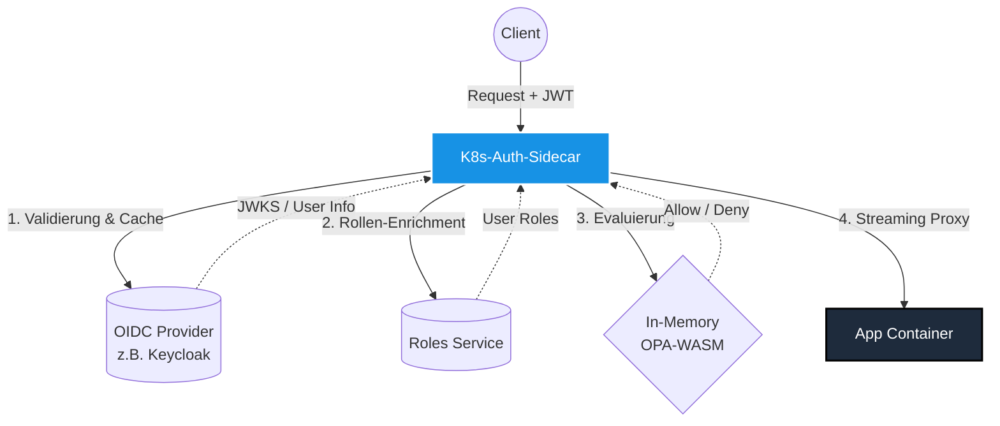

<div align="center">
  

  # K8s-Auth-Sidecar - AuthN/AuthZ Sidecar für Kubernetes

  [](https://quarkus.io)
  [](https://openjdk.org)
  [](LICENSE)
  [](#-so-testest-du-das-projekt--schritt-f%C3%BCr-schritt-super-einfach-erkl%C3%A4rt)
  [](#7-mutation-testing-pit--qualit%C3%A4ts-check)
  [](https://www.docker.com/)
  [](https://kubernetes.io/)
</div>

**K8s-Auth-Sidecar** (Request Router Sidecar) ist ein Quarkus-basierter Microservice, der als Sidecar in Kubernetes-Pods läuft und Authentifizierung (AuthN) sowie Autorisierung (AuthZ) für den Haupt-Container übernimmt – inklusive dynamischem Rollen-Enrichment und blitzschneller lokaler Entwicklung.

> [!NOTE]
> Dieses Projekt ist für Cloud-Native Umgebungen optimiert, unterstützt **Native Image** via GraalVM und bietet **Hot-Reload** für Sicherheits-Policies.

---

> [!TIP]
> ## 🚀 POC‑Ready
> Das Projekt bildet alle Kernfeatures vollständig und stabil ab: **OIDC-Validierung (Keycloak & Entra ID), embedded OPA-WASM-Autorisierung und reaktives Streaming-Proxy**. Eine sofort lauffähige Demo startet in unter 3 Minuten:
> ```bash
> docker compose -f docker-compose.demo.yml up -d   # Demo-Stack (WireMock + Sidecar)
> ```
> Ideal für Stakeholder-Demos, technische Evaluierungen und Proof-of-Concept-Reviews.

---

## ✨ Features

- ⚡ **Blitzschnelle lokale Entwicklung**: Out-of-the-Box Mocking für Identity Provider (Keycloak) via WireMock.
- 🏢 **OIDC-Support**: Standardisierter Support für Keycloak, Microsoft Entra ID und generische OIDC-Provider.
- 🧠 **Embedded Policy-Engine**: In-Memory OPA-WASM-Engine mit Hot-Reload der `.rego` Regeln.
- ⚡ **Reaktive Pipeline**: Vollständig non-blocking AuthN → AuthZ Verarbeitung mit Mutiny `Uni`.
- 🛡️ **Zero-Trust**: Jede Anfrage wird zwingend validiert.
- 📡 **Streaming Proxy**: Request-Bodies werden **nie** vollständig in den RAM geladen – echtes Vert.x Streaming für beliebig große Payloads.
- 🎯 **Zentrales Path-Matching**: Ant-Style Patterns (`/**`, `/*`) über praktisches `PathMatcher`-Utility.
- 🚀 **Native Image Support**: Minimale Startup-Zeit (< 100ms) und extrem geringer Memory-Footprint.
- 📊 **Observability**: Prometheus Metrics, JSON Logging und Health Checks out-of-the-box.

---

## ⚡ Quick-Start (Local Dev)

Beschleunige deine lokale Entwicklung in Sekunden:

```bash
# 1. Infrastruktur starten (WireMock auf Port 8090)
docker compose -f docker-compose.dev.yml up -d

# 2. Sidecar im Dev-Modus starten (mit Hot-Reload)
mvn quarkus:dev

# 3. Test-Token abrufen & Request senden
export TOKEN=$(curl -s -X POST http://localhost:8090/realms/master/protocol/openid-connect/token | jq -r .access_token)
curl -H "Authorization: Bearer $TOKEN" http://localhost:8080/api/v1/something
```

Für eine detaillierte Einführung siehe den [JUNIOR_GUIDE.md](JUNIOR_GUIDE.md).

---

## 🏗️ Architektur & Funktionsweise

Der Sidecar fungiert als intelligenter **Türsteher** vor deinem Anwendungs-Container. Er fängt alle eingehenden Anfragen ab, validiert die Identität und prüft die Berechtigungen gegen lokal geladene OPA-WASM-Policies.


```mermaid
graph TD
    Client((Client)) -->|Request + JWT| Sidecar[K8s-Auth-Sidecar]
    Sidecar -->|1. Validierung & Cache| OIDC[(OIDC Provider<br/>z.B. Keycloak)]
    OIDC -.->|JWKS / User Info| Sidecar
    Sidecar -->|2. Rollen-Enrichment| RS[(Roles Service)]
    RS -.->|User Roles| Sidecar
    Sidecar -->|3. Evaluierung| OPA{In-Memory<br/>OPA-WASM}
    OPA -.->|Allow / Deny| Sidecar
    Sidecar -->|4. Streaming Proxy| Backend[App Container]
    
    style Sidecar fill:#1792E5,stroke:#fff,stroke-width:2px,color:#fff
    style Backend fill:#1E2B3C,stroke:#000,stroke-width:2px,color:#fff
```

### 🧠 Die Pipeline im Detail
Jeder Request durchläuft diese reaktiven Schritte:
1.  **🔍 Token Extraktion & Authentifizierung (`AuthProxyFilter`)**: Ein JAX-RS Filter extrahiert den Bearer-Token, validiert Signatur/Issuer via Caffeine-Cache und injiziert einen sicheren `AuthContext`. Schlägt dies fehl, blockt der Filter sofort ab (`HTTP 401`).
2.  **⚖️ Policy Check & Autorisierung (`AuthorizationUseCase`)**: In-Memory Evaluierung via WASM anhand des `AuthContext` (inkl. extrahierter Rollen) gegen vorkompilierte `.rego` Regeln.
3.  **🚀 Proxying**: Effizientes Streaming an das Backend über Mutiny `Uni`. Request-Bodies werden **nie** vollständig in den RAM geladen!

---

## ⚙️ Konfiguration

Über Umgebungsvariablen lässt sich der Sidecar flexibel anpassen:

| Variable | Beschreibung | Standard |
|----------|--------------|----------|
| `OIDC_AUTH_SERVER_URL` | OIDC-Endpunkt (Discovery) | `http://localhost:8090/realms/master` |
| `OIDC_CLIENT_ID` | Client Identifier | `k8s-auth-sidecar` |
| `PROXY_TARGET_PORT` | Port deiner eigentlichen App | `8081` |
| `AUTHZ_ENABLED` | Policy-Prüfung ein/aus | `true` |
| `OPA_WASM_PATH` | Pfad zur OPA-WASM Datei | `classpath:policies/authz.wasm` |

---

## 🚢 Kubernetes Deployment

Integriere den Sidecar einfach als zweiten Container in dein Pod-Spec:

```yaml
spec:
  containers:
    - name: my-application
      image: my-app:latest
      ports: [{containerPort: 8081}]

    - name: k8s-auth-sidecar
      image: ghcr.io/maatini/k8s-auth-sidecar:0.3.0
      env:
        - name: PROXY_TARGET_PORT
          value: "8081"
        - name: OIDC_AUTH_SERVER_URL
          value: "https://keycloak.example.com/realms/myrealm"
```

---

## 🧪 So testest du das Projekt – Schritt für Schritt (super einfach erklärt)

Hier erfährst du, wie du sicherstellst, dass alles perfekt läuft. Wir gehen von "sehr einfach" bis zu "Profi-Check".

#### 1. Lokale Entwicklung (am schnellsten)
**Was du tust:** Starte den Sidecar im Entwicklungs-Modus.
- **Befehl:** `mvn quarkus:dev`
- **Was du sehen solltest:** Quarkus startet in wenigen Sekunden. Du siehst "Profile dev activated".
- **Warum das wichtig ist:** Du kannst Code ändern und siehst die Auswirkungen sofort (Hot Reload).

> [!TIP]
> **Junior-Tipp:** Nutze die Taste `r` im Terminal, um alle Tests im Dev-Modus manuell neu zu triggern!

#### 2. Unit- & POJO-Tests (ohne Quarkus-Start)
**Was du tust:** Führe die reinen Logik-Tests aus.
- **Befehl:** `mvn test -Dtest=*PojoTest`
- **Was du sehen solltest:** Eine Liste von Tests, die in Millisekunden durchlaufen.
- **Warum das wichtig ist:** Diese Tests sind super schnell und prüfen die "Business Logic", ohne dass das ganze Framework hochfahren muss.

#### 3. Vollständige Integrationstests (mit WireMock)
**Was du tust:** Teste das Zusammenspiel mit OIDC und Roles-Service.
- **Voraussetzung:** `docker compose -f docker-compose.dev.yml up -d`
- **Befehl:** `mvn verify`
- **Was du sehen solltest:** Quarkus fährt hoch, kontaktiert den (gemockten) Keycloak und führt echte HTTP-Requests aus.
- **Warum das wichtig ist:** Das ist der "Realitäts-Check" vor dem Deployment.

#### 4. Policy-Tests (opa test)
**Was du tust:** Prüfe deine Sicherheitsregeln (`.rego` Dateien).
- **Befehl:** `opa test opa-wasm/src/main/resources/policies/ -v` (wenn OPA installiert ist)
- **Was du sehen solltest:** `PASS` für alle definierten Regeln.
- **Warum das wichtig ist:** So verhinderst du, dass du dich versehentlich selbst aussperrst oder Sicherheitslücken einbaust.

#### 5. Docker-Image bauen & testen
**Was du tust:** Erstelle ein fertiges Container-Image.
- **Befehl (JVM):** `docker build -t auth-sidecar:latest .`
- **Befehl (Native):** `docker build -f Dockerfile.native -t auth-sidecar:native .`
- **Was du sehen solltest:** Ein fertiges Docker-Image in deiner lokalen Liste (`docker images`).
- **Warum das wichtig ist:** So läuft der Sidecar später auch in Kubernetes.

#### 6. Kubernetes-Deployment testen (kustomize)
**Was du tust:** Generiere die finalen YAML-Dateien für K8s.
- **Befehl:** `kubectl kustomize k8s/overlays/development`
- **Was du sehen solltest:** Einen langen Output mit allen Kubernetes-Ressourcen (Deployments, Services, ConfigMaps).
- **Warum das wichtig ist:** Du siehst genau, was auf dem Cluster landen würde, bevor du `kubectl apply` machst.

#### 7. Mutation Testing (PIT) – Qualitäts-Check
**Was du tust:** Lasse die "Test-Polizei" über deinen Code laufen.
- **Befehl:** `mvn org.pitest:pitest-maven:mutationCoverage`
- **Was du sehen solltest:** Einen HTML-Report in `target/pit-reports/`.
- **Warum das wichtig ist:** PIT verändert deinen Code absichtlich ("Mutanten"). Wenn deine Tests das nicht merken, sind sie nicht gut genug. Wir zielen auf **> 70% Test Strength**!

> [!IMPORTANT]
> **Junior-Tipp:** Wenn PIT eine Mutation nicht findet, überlege dir einen Edge-Case (z.B. "Was passiert, wenn der Header leer ist?"), den du noch nicht getestet hast.

#### 8. Aktuelle Test-Metriken (gemessen 2026-03-13)

Das Projekt besitzt eine extrem schnelle, überwiegend Framework-unabhängige Test-Suite:

| Modul | Tests | Failures | Typ |
|-------|------:|:--------:|-----|
| `auth-core` | 47 | 0 ✅ | POJO + Ext + Quarkus |
| `opa-wasm` | 47 | 0 ✅ | POJO + Ext + Quarkus |
| `config` | 7 | 0 ✅ | Quarkus |
| `proxy` | 26 | 0 ✅ | POJO + Ext + E2E |
| **Gesamt** | **127** | **0 ✅** | |

**PIT Mutation Testing (`auth-core`):**
- **Line Coverage**: 71% (247/349 Zeilen)
- **Test Strength**: **82%** ✅ (Ziel: > 80%)
- Bericht: `auth-core/target/pit-reports/`

**Begriffsklärung:**
- **Line Coverage**: Wie viel Prozent des Codes wurden mindestens einmal ausgeführt?
- **Test Strength**: Wie viele künstliche Fehler (Mutanten) wurden von den Tests gefunden? — Unser wichtigster Qualitätsindikator.

---

---

## 📂 Projektstruktur (Maven Multi-Module)

- `auth-core/`: Domain-Modelle, Request-Processor und Auth-Logik.
- `proxy/`: Vert.x Streaming Proxy und JAX-RS Filter.
- `opa-wasm/`: OPA WASM Engine und Rego-Policies (`.rego`).
- `config/`: Quarkus-Config, Metriken und Health-Checks.
- `k8s/`: Kustomize Manifeste für das Deployment.

---

## 🛡️ Sicherheit & Performance

- **Zero-Allocation Logging**: JSON-Logs für schnelle Verarbeitung.
- **Trusted Proxies**: Schutz vor IP-Spoofing für `X-Forwarded-For`.
- **Non-blocking Proxy**: Basiert auf Vert.x WebClient für maximale Skalierbarkeit.
- **WASM Hot-Reload**: Ersetze Policies im laufenden Betrieb ohne Downtime.
- **⚠️ Durchsatz-Hinweis (> 1000 RPS)**: Bei hoher Last (> 1000 Req/s) wurden in Lasttests Engpässe identifiziert (Event-Loop Blockade, Connection-Pool-Limit, synchrones Logging). Die Architektur ist bereits auf deren Beseitigung ausgelegt; die konkreten Optimierungen sind in [`docs/ARCHITECTURE.md` → Roadmap](docs/ARCHITECTURE.md#-performance--production-readiness-roadmap) dokumentiert. **Für den POC ist dies irrelevant.**

---

## 📄 Lizenz & Kontakt

Apache License 2.0 - siehe [LICENSE](LICENSE).

Entwickelt von **[space.maatini](https://github.com/maatini)**
