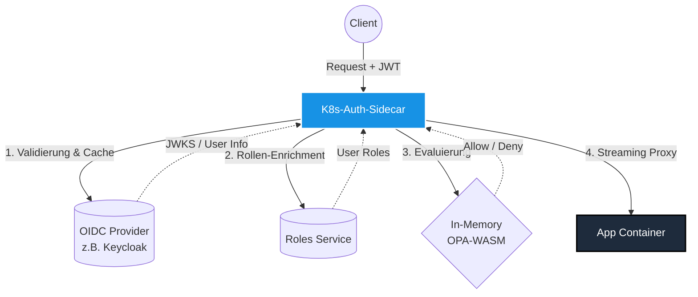

<div align="center">
  

  # K8s-Auth-Sidecar - AuthN/AuthZ Sidecar für Kubernetes

  [](https://quarkus.io)
  [](https://openjdk.org)
  [](LICENSE)
  [](https://www.docker.com/)
  [](https://kubernetes.io/)
</div>

**K8s-Auth-Sidecar** (Request Router Sidecar) ist ein Quarkus-basierter Microservice, der als Sidecar in Kubernetes-Pods läuft und Authentifizierung (AuthN) sowie Autorisierung (AuthZ) für den Haupt-Container übernimmt – inklusive dynamischem Rollen-Enrichment und blitzschneller lokaler Entwicklung.

> [!NOTE]
> Dieses Projekt ist für Cloud-Native Umgebungen optimiert, unterstützt **Native Image** via GraalVM und bietet **Hot-Reload** für Sicherheits-Policies.

---

## ✨ Features

- ⚡ **Blitzschnelle lokale Entwicklung**: Out-of-the-Box Mocking für Identity Provider (Keycloak) via WireMock.
- 🏢 **OIDC-Support**: Standardisierter Support für Keycloak, Microsoft Entra ID und generische OIDC-Provider.
- 🧠 **Embedded Policy-Engine**: In-Memory OPA-WASM-Engine mit Hot-Reload der `.rego` Regeln.
- ⚡ **Reaktive Pipeline**: Vollständig non-blocking AuthN → AuthZ Verarbeitung mit Mutiny `Uni`.
- 🛡️ **Zero-Trust**: Jede Anfrage wird zwingend validiert.
- 📡 **Streaming Proxy**: Request-Bodies werden **nie** vollständig in den RAM geladen – echtes Vert.x Streaming für beliebig große Payloads.
- 🎯 **Zentrales Path-Matching**: Ant-Style Patterns (`/**`, `/*`) über praktisches `PathMatcher`-Utility.
- 🚀 **Native Image Support**: Minimale Startup-Zeit (< 100ms) und extrem geringer Memory-Footprint.
- 📊 **Observability**: Prometheus Metrics, JSON Logging und Health Checks out-of-the-box.

---

## ⚡ Quick-Start (Local Dev)

Beschleunige deine lokale Entwicklung in Sekunden:

```bash
# 1. Infrastruktur starten (WireMock auf Port 8090)
docker compose -f docker-compose.dev.yml up -d

# 2. Sidecar im Dev-Modus starten (mit Hot-Reload)
mvn quarkus:dev

# 3. Test-Token abrufen & Request senden
export TOKEN=$(curl -s -X POST http://localhost:8090/realms/master/protocol/openid-connect/token | jq -r .access_token)
curl -H "Authorization: Bearer $TOKEN" http://localhost:8080/api/v1/something
```

Für eine detaillierte Einführung siehe den [JUNIOR_GUIDE.md](JUNIOR_GUIDE.md).

---

## 🏗️ Architektur

Der Sidecar fungiert als intelligenter Reverse-Proxy vor deinem Anwendungs-Container. Er fängt alle eingehenden Anfragen ab, validiert die Identität und prüft die Berechtigungen gegen lokal geladene OPA-WASM-Policies.


```mermaid
graph TD
    Client((Client)) -->|Request + JWT| Sidecar[K8s-Auth-Sidecar]
    Sidecar -->|1. Validierung & Cache| OIDC[(OIDC Provider<br/>z.B. Keycloak)]
    OIDC -.->|JWKS / User Info| Sidecar
    Sidecar -->|2. Rollen-Enrichment| RS[(Roles Service)]
    RS -.->|User Roles| Sidecar
    Sidecar -->|3. Evaluierung| OPA{In-Memory<br/>OPA-WASM}
    OPA -.->|Allow / Deny| Sidecar
    Sidecar -->|4. Streaming Proxy| Backend[App Container]
    
    style Sidecar fill:#1792E5,stroke:#fff,stroke-width:2px,color:#fff
    style Backend fill:#1E2B3C,stroke:#000,stroke-width:2px,color:#fff
```

Detaillierte Architektur-Details findest du in [docs/ARCHITECTURE.md](docs/ARCHITECTURE.md).

---

## 🧠 Funktionsweise im Detail

Jeder Request durchläuft eine reaktive Pipeline:
1. **🔍 Token Validierung**: Signatur, Ablaufdatum, Issuer (Caffeine Cache optimiert).
2. **⚖️ Policy Check**: In-Memory Evaluierung via WASM (vorkompilierte Rego-Regeln).
3. **🚀 Proxying**: Effizientes Streaming an das Backend (standardmäßig Port 8081).

---

## ⚙️ Konfiguration

### Umgebungsvariablen (Auszug)

| Variable | Beschreibung | Standard |
|----------|--------------|----------|
| `OIDC_AUTH_SERVER_URL` | OIDC-Endpunkt | `http://localhost:8090/realms/master` |
| `OIDC_CLIENT_ID` | Client Identifier | `k8s-auth-sidecar` |
| `PROXY_TARGET_PORT` | Port deiner App | `8081` |
| `AUTHZ_ENABLED` | Policy-Prüfung ein/aus | `true` |
| `OPA_WASM_PATH` | Pfad zur OPA-WASM Datei | `classpath:policies/authz.wasm` |

---

## 🚢 Kubernetes Deployment

Integriere den Sidecar einfach in dein Pod-Spec:

```yaml
spec:
  containers:
    - name: my-application
      image: my-app:latest
      ports: [{containerPort: 8081}]

    - name: k8s-auth-sidecar
      image: ghcr.io/maatini/k8s-auth-sidecar:0.3.0
      env:
        - name: PROXY_TARGET_PORT
          value: "8081"
        - name: OIDC_AUTH_SERVER_URL
          value: "https://keycloak.example.com/realms/myrealm"
```

---

## 🧪 Testing & Docker Build

### Testmetriken (Stand 2026-03-06)

Tests werden als **reine POJOs** (ohne Quarkus-Start) ausgeführt – dadurch erreichen wir eine extrem schnelle Ausführung und eine hohe Mutationsabdeckung in der Kernlogik.

| Modul | Status | Tests | PIT Line Coverage | PIT Mutation | PIT Test Strength |
| :--- | :--- | :--- | :--- | :--- | :--- |
| **config** | SUCCESS | 5 | 60% | 26% | **71%** |
| **auth-core** | SUCCESS | 43 | 69% | 48% | **80%** |
| **opa-wasm** | SUCCESS | 47 | 64% | 52% | **69%** |
| **proxy** | SUCCESS ¹ | 26 ² | n/a | n/a | n/a |
| **Gesamt** | **SUCCESS** | **121** ³ | **~65%** | **~47%** | **~73%** |

> ¹ 26 stabile POJO+ExtTests – 8 QuarkusIntegrationTests schlagen ohne laufenden WireMock-Stack fehl (erwartet).  
> ² Nur POJO+ExtTests gezählt (stabile Tests). Vollständiger Proxy-Test-Run erfordert `docker-compose.dev.yml`.  
> ³ POJO+ExtTests gesamt (108 grün) + Config QuarkusTests (3) + OPA QuarkusTests (10) = 121 stabile Tests.

- **PIT Test Strength**: % der Mutanten, die von gedeckten Tests getötet werden (bester Qualitäts-Indikator).
- **auth-core Services** (application.service): **91% Line Coverage, 77% Mutation Coverage** – beste Kernlogik-Abdeckung.

### Docker Build

```bash
# JVM Image (Standard)
docker build -t ghcr.io/maatini/k8s-auth-sidecar:0.3.0 .

# Native Image (Optimiert für K8s)
docker build -f Dockerfile.native -t ghcr.io/maatini/k8s-auth-sidecar:0.3.0-native .
```

---

## 📂 Projektstruktur (Maven Multi-Module)

- `auth-core/`: Domain-Modelle, Request-Processor und Auth-Logik.
- `proxy/`: Vert.x Streaming Proxy und JAX-RS Filter.
- `opa-wasm/`: OPA WASM Engine und Rego-Policies (`.rego`).
- `config/`: Quarkus-Config, Metriken und Health-Checks.
- `k8s/`: Kustomize Manifeste für das Deployment.

---

## 🛡️ Sicherheit & Performance

- **Zero-Allocation Logging**: JSON-Logs für schnelle Verarbeitung.
- **Trusted Proxies**: Schutz vor IP-Spoofing für `X-Forwarded-For`.
- **Non-blocking Proxy**: Basiert auf Vert.x WebClient für maximale Skalierbarkeit.
- **WASM Hot-Reload**: Ersetze Policies im laufenden Betrieb ohne Downtime.

---

## 📄 Lizenz & Kontakt

Apache License 2.0 - siehe [LICENSE](LICENSE).

Entwickelt von **[space.maatini](https://github.com/maatini)**
