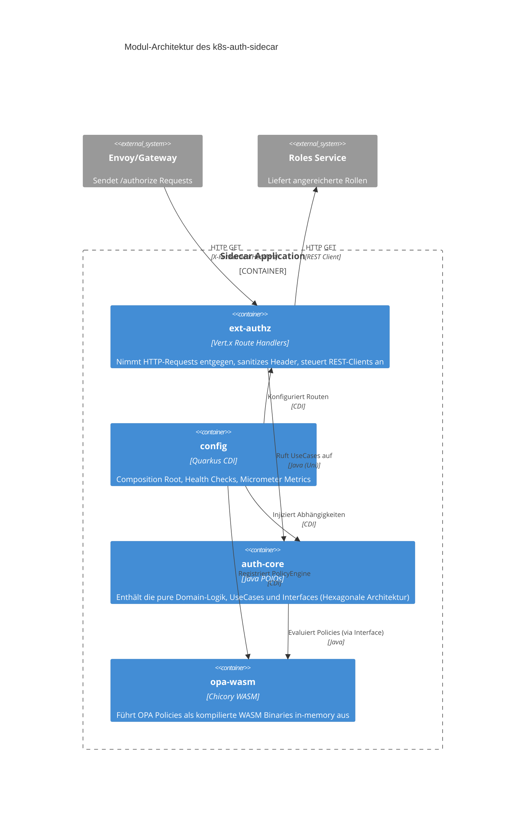

# AuthN/AuthZ Sidecar - Architektur & Implementierungsplan

## Übersicht

Der **k8s-auth-sidecar** (Request Router Sidecar) ist ein Quarkus-basierter Microservice, der als Sidecar in einem Kubernetes-Pod läuft und Authentifizierung (AuthN) sowie Autorisierung (AuthZ) für den Haupt-Container übernimmt.

## Architekturdiagramm (ASCII)


## Request Flow


## Module Architecture & Responsibilities (Maven Multi-Module)

Die Architektur des k8s-auth-sidecar folgt strengen modularen Prinzipien. Jeder Bereich ist in ein eigenes Maven-Modul gekapselt, um Verantwortlichkeiten sauber zu trennen und Dependency Inversion zu erzwingen.

### auth-core

**Zweck / Verantwortlichkeit**  
Das `auth-core`-Modul ist das Herzstück der Anwendung und enthält die reine Domain-Logik (POJO-First) ohne jegliche Infrastruktur-, Framework- oder REST-Abhängigkeiten.

**Wichtige Packages**  
- `de.edeka.eit.sidecar.domain.model`
- `de.edeka.eit.sidecar.application.service`
- `de.edeka.eit.sidecar.usecase.*`

**Kern-Klassen / Komponenten**  
- `AuthorizationUseCase`: Orchestriert den gesamten Autorisierungsprozess (Token validieren, Rollen laden, Policy anwenden).
- `AuthContext`: Zentrales Domain-Model, das Benutzer-Identität, extrahierte Claims und angereicherte Rollen/Berechtigungen bündelt.
- `PolicyEngine` (Interface): Abstraktion für die Policy-Evaluierung, die durch das WASM-Modul implementiert wird.
- `UserInfoResponseBuilder`: Kapselt die Logik zur Transformation eines `AuthContext` in ein standardisiertes `UserInfoResponse`-Objekt.

**Verantwortlichkeiten im Detail**  
- Validierung von JWTs und Extraktion von Basis-Claims (via `JwtClaimExtractor`).
- Bereitstellung von Interfaces (Ports) für externe Systeme wie Identity Provider, Roles-Services und Policy-Engines.
- Evaluierung der Business-Zustände und Rückgabe detaillierter `ProcessingResult`-Objekte zur sauberen Fehlerbehandlung in der Präsentationsschicht.
- Technologiefokus: Reines Java 21, Mutiny (`Uni`) für nicht-blockierende reaktive Pipelines, Verzicht auf `@Inject` oder Quarkus-spezifische Annotationen in der Core-Schicht.

**Interaktion mit anderen Modulen**  
Das Modul wird vom `ext-authz` (welches Requests entgegennimmt) aufgerufen und konsumiert Implementierungen der Infrastruktur (wie `opa-wasm` und Clients für den Roles-Service aus `ext-authz` bzw. config). Es hat keine Abhängigkeiten zu den anderen Modulen (Dependency Rule).

**Wichtige Konzepte / Patterns**  
- **POJO-First**: Keine Quarkus-Annotationen, 100% isolierbar und per Mutation-Testing (PIT) testbar.
- **Port & Adapter (Hexagonal)**: Definiert Interfaces, die von außen implementiert werden.
- **Mutiny Uni**: Alle Operationen sind durchgängig asynchron und non-blocking.

---

### ext-authz

**Zweck / Verantwortlichkeit**  
Dieses Modul übernimmt das Request-Routing (Präsentationsschicht), die Absicherung gegen Header-Spoofing und fungiert als primärer Einstiegspunkt (PDP) für das Envoy/Nginx-Gateway.

**Wichtige Packages**  
- `de.edeka.eit.sidecar.infrastructure.route`
- `de.edeka.eit.sidecar.infrastructure.security`
- `de.edeka.eit.sidecar.infrastructure.roles`

**Kern-Klassen / Komponenten**  
- `SidecarRouteHandler`: Vert.x HTTP-Route für `GET /authorize`, die den Input parst und an den `AuthorizationUseCase` weiterreicht.
- `UserInfoRouteHandler`: Vert.x HTTP-Route für `GET /userinfo`, liefert das JSON des Benutzers zurück.
- `HeaderSanitizer`: Validiert und bereinigt Envoy-Header (`X-Forwarded-Uri`, `X-Forwarded-Method`), um Path-Traversal und Privilege Escalation zu verhindern.
- `RolesClient`: Ein reaktiver Quarkus REST-Client zur Anbindung des externen Rollen-Microservices.

**Verantwortlichkeiten im Detail**  
- Bereitstellung der HTTP-Endpunkte (Routes) auf Basis von Vert.x Reactive.
- Transformation von rohen HTTP-Headern in strukturierte `PolicyInput`-Objekte für den Core.
- Durchsetzung von Rate-Limiting und Schutzmaßnahmen gegen IP-Spoofing (`X-Forwarded-For`).
- Primärer Technologiestack: Vert.x Web, Quarkus REST Client Reactive, Caffeine (für Caching).

**Interaktion mit anderen Modulen**  
Das Modul instanziiert bzw. registriert die Routen in Quarkus und ruft die UseCases aus `auth-core` auf. Es leitet die aus dem HTTP-Request gewonnenen Parameter an die Domain weiter und übersetzt `ProcessingResult` in HTTP-Statuscodes (200, 401, 403, 500).

**Wichtige Konzepte / Patterns**  
- **Reactive Route Handler**: Verzicht auf JAX-RS (Resteasy) zugunsten von leichtgewichtigen, hochperformanten Vert.x-Routen.
- **Defense-in-Depth**: Strikte Validierung aller Eingangsdaten durch den `HeaderSanitizer`.
- **Fail-Fast / Circuit Breaker**: Externe Aufrufe (z.B. Roles-Service) sind gegen Timeouts abgesichert.

---

### config

**Zweck / Verantwortlichkeit**  
Hier findet das Zusammenbinden der Applikation (Dependency Injection Configuration), das Monitoring und die Bereitstellung applikationsweiter Infrastruktur (Health-Checks) statt.

**Wichtige Packages**  
- `de.edeka.eit.sidecar.infrastructure.config`
- `de.edeka.eit.sidecar.infrastructure.health`

**Kern-Klassen / Komponenten**  
- `SidecarConfig`: Definiert CDI (`@Produces`) Beans, die die reinen Java-POJOs aus dem `auth-core` instanziieren und mit den Quarkus-spezifischen Adaptern verknüpfen.
- `LivenessCheck` / `ReadinessCheck`: Überwachen den Zustand der Anwendung und der integrierten OPA-Engine für Kubernetes.

**Verantwortlichkeiten im Detail**  
- Konfiguration der Quarkus-Anwendung (Auslesen properties).
- Erstellung des OIDC-Clients und Einbindung der Quarkus-Security.
- Bereitstellung von Micrometer-Metriken (Prometheus) zur Laufzeitüberwachung.
- Bereitstellung der `/q/health`-Endpunkte für den Kubelet-Probes.

**Interaktion mit anderen Modulen**  
Das Modul aggregiert `auth-core`, `ext-authz` und `opa-wasm` als Maven-Abhängigkeiten. Es fungiert als Composition Root für das Dependency Injection und injiziert die konkrete `WasmPolicyEngine` in die Services des Cores.

**Wichtige Konzepte / Patterns**  
- **Composition Root**: Der einzige Ort, an dem Framework (Quarkus) und fachliche Implementierung (`auth-core`) verheiratet werden.
- **Auto-Config (Dev-Mode)**: Umschalten auf In-Memory Mock-Clients während der lokalen Entwicklung.

---

### opa-wasm

**Zweck / Verantwortlichkeit**  
Implementiert einen extrem schnellen, In-Memory Policy Decision Point (PDP) durch das Kompilieren und Ausführen von OPA (Open Policy Agent) Rego-Policies als WebAssembly (WASM).

**Wichtige Packages**  
- `de.edeka.eit.sidecar.infrastructure.policy`

**Kern-Klassen / Komponenten**  
- `WasmPolicyEngine`: Implementiert das `PolicyEngine` Interface aus dem Core. Lädt WASM-Binaries, verwaltet den Hot-Reloading-Thread und evaluiert Anfragen.
- `Chicory` (als Bibliothek im Hintergrund): Eine pure-Java WASM-Laufzeitumgebung.

**Verantwortlichkeiten im Detail**  
- Laden der vorkompilierten `authz.wasm` Policies aus dem Classpath (oder via Volume-Mount).
- Verwaltung eines Threads-Pools / Queues (`AtomicReference<ArrayBlockingQueue>`) für WASM-Instanzen, da WASM State-Management nicht thread-safe ist.
- Abstraktion des komplexen JSON-Marshalling (Eingabe des `AuthContext` in die WASM-Umgebung und Extrahierung des Ergebnisses).
- Automatisches Hot-Reloading bei Änderungen an der WASM-Datei ohne Neustart der Anwendung.

**Interaktion mit anderen Modulen**  
Implementiert das Interface `PolicyEngine` aus dem `auth-core` und ist somit die Ausführungs-Maschine der Autorisierung. Wird vom `config`-Modul registriert.

**Wichtige Konzepte / Patterns**  
- **Zero-Dependency WASM**: Ausführung der compiled Rego-Policies direkt in der JVM via Chicory (keine nativen Bibliotheken oder externen OPA-Container nötig).
- **Object Pool Pattern**: Wiederverwendung von vorkonfigurierten WASM-Instanzen zwecks Reduzierung des GC- und CPU-Overheads ("Pool Exhaustion" Vermeidung).
- **Hot-Reload**: Hintergrund-Watcher, der die WASM-Datei auf dem Filesystem überwacht und bei Updates den Instanz-Pool non-blocking austauscht.

---

### Architectural Overview (C4 Container Diagram)



### Request Flow (Sequence Überblick)

1. **Gateway** (Envoy) fängt Request des Clients ab und sendet ein `GET /authorize` (mit Original-Tokens und Headern) an den Sidecar.
2. **ext-authz** (`SidecarRouteHandler`) empfängt Request, parst Header via `HeaderSanitizer` und schickt einen asynchronen Aufruf (Mutiny) an den `AuthorizationUseCase`.
3. **auth-core** (`AuthorizationUseCase`) steuert den Workflow:
   - Extrahiert Claims aus dem Token.
   - Ruft `RolesService` Interface (implementiert in `ext-authz`) auf, um Rollen vom externen System zu holen.
   - Bündelt alles in einem `AuthContext`.
4. **auth-core** fragt `PolicyEngine` (implementiert in `opa-wasm`) zur Evaluierung an.
5. **opa-wasm** wandelt `AuthContext` in JSON, führt die WASM-Policy aus und liefert eine `PolicyDecision` (Allow/Deny) an den Core zurück.
6. **ext-authz** wertet das `ProcessingResult` des Cores aus und sendet abschließend HTTP `200 OK` (mit neuen Headern für die Rollen) oder `401`/`403` an das Gateway zurück.

### Developer Recommendations (Einstiegspunkte für Features)

*   **Neue Auth-Logik oder UseCases ("Was" soll passieren):** Immer zuerst in `auth-core` als POJO entwickeln. Keine Framework-Imports verwenden! Nutze PIT Mutation-Testing für >80% Qualität.
*   **Neue REST-Endpoints (z.B. `/userinfo`):** Im Modul `ext-authz` unter `infrastructure/route/` anlegen und als Vert.x-Route einklinken.
*   **Andere Policy-Sprachen oder Evaluatoren:** Eine neue Implementierung des `PolicyEngine`-Interfaces schreiben (z.B. ein neues Modul `cedar-evaluator` schnüren und in `config` injizieren). 
*   **Neue externe APIs anbinden (z.B. Fraud-Detection):** Interface im `auth-core` definieren, den REST-Client im `ext-authz` (analog zu `RolesClient`) implementieren.


## Betriebsmodus

### Gateway Mode (ext_authz)
Der Sidecar wird von einem externen Gateway (Envoy/Nginx) zur Autorisierung kontaktiert.
- **Endpoint**: `GET /authorize`.
- **Logic**: Der Sidecar wertet die Header `X-Forwarded-Uri` und `X-Forwarded-Method` aus, führt das Rollen-Enrichment durch (`RolesService`) und evaluiert dann die OPA-Policies.
- **Response**: `200 OK` delegiert die Anfrage an das eigentliche Ziel weiter. Rollen-Enrichment erfolgt über Antwort-Header (`X-Auth-User-Id`, `X-Enriched-Roles`).

### UserInfo Endpoint
Verarbeitet Anfragen nach strukturierten Benutzerinformationen des angemeldeten Benutzers.
- **Endpoint**: `GET /userinfo`.
- **Logic**: Durchläuft dieselbe AuthN/AuthZ Pipeline wie `/authorize`. Extrahiert nach erfolgreicher Autorisierung die Identität, (angereicherte) Rollen sowie gruppierte Berechtigungen (z.B. `{"orders": ["read", "write"]}`) aus dem `AuthContext`.
- **Response**: Ein strukturiertes JSON-Dokument mit Benutzerinformationen, Rollen und Berechtigungen.

## Architektur für lokale Entwicklung (Dev-Profil & Mocking)

Für eine erstklassige Developer Experience ohne externe Abhängigkeiten nutzt der Sidecar im Quarkus `%dev` Profil ein dediziertes Setup:
- **WireMock-Integration**: Zwei vorkonfigurierte WireMock-Instanzen (`docker-compose.dev.yml`) simulieren den Identity Provider (OIDC Discovery, JWKS, Token-Generierung) und den externen Roles-Service (dynamische Response-Templates).
- **In-Memory Alternative**: Für reine Code-Tests ohne Container kann ein `@IfBuildProfile("dev")`-getaggter Client (`InMemoryRolesService`) als Fallback einkompiliert werden.
- **Auto-Config**: Im `%dev`-Modus werden Caches für Roles und Policies deaktiviert, um sofortige Testrückmeldungen (Live-Reloading) zu ermöglichen.

## Technologie-Stack

| Komponente | Technologie |
|------------|-------------|
| Runtime | Quarkus 3.32.x (Native Image Support) |
| Language | Java 21 |
| OIDC | quarkus-oidc |
| HTTP Client | quarkus-rest-client-reactive |
| Policy Engine | OPA WASM (Chicory Embedded) |
| Metrics | Micrometer + Prometheus |
| Logging | quarkus-logging-json |
| Container | GraalVM Native Image |
| Orchestration | Kubernetes Sidecar Pattern |

## Konfiguration

### Umgebungsvariablen

```bash
# Identity Provider (OIDC / Keycloak)
OIDC_AUTH_SERVER_URL=https://keycloak.example.com/realms/myrealm
OIDC_CLIENT_ID=my-client

# Roles Microservice
ROLES_SERVICE_URL=http://roles-service:8080
ROLES_SERVICE_PATH=/api/v1/users/{userId}/roles

# OPA (Embedded WASM via Chicory)
OPA_WASM_PATH=/policies/policy.wasm
OPA_POOL_SIZE=50
OPA_HOT_RELOAD_INTERVAL=10s

# Feature Toggles
AUTH_ENABLED=true
AUTHZ_ENABLED=true
OPA_ENABLED=true
ROLES_ENABLED=true

# Metrics & Logging
QUARKUS_LOG_LEVEL=INFO
OTEL_ENABLED=false
```

## Policy-Beispiel (Rego)

```rego
package authz

default allow = false

# Erlaubt Zugriff wenn User die benötigte Rolle hat
allow {
    required_role := role_mapping[input.request.path][input.request.method]
    required_role == input.user.roles[_]
}

# Mapping von Pfaden zu benötigten Rollen
role_mapping := {
    "/api/admin": {"GET": "admin", "POST": "admin"},
    "/api/users": {"GET": "user", "POST": "admin"},
    "/api/public": {"GET": "public"}
}

# Erlaubt Zugriff für superadmin
allow {
    input.user.roles[_] == "superadmin"
}
```

## Deployment

### Sidecar-Pattern in Kubernetes

```yaml
spec:
  containers:
    # Main Application Container
    - name: application
      image: my-app:latest
      ports:
        - containerPort: 8085
    
    # Sidecar Container (AuthN/AuthZ)
    - name: k8s-auth-sidecar
      image: ghcr.io/maatini/k8s-auth-sidecar:0.3.0
      ports:
        - containerPort: 8080
      # Note: The sidecar operates as an ext_authz endpoint.
      # Configure your ingress/envoy to call /authorize on this container.
```

## 🧪 Implementierungsplan & Testing-Strategie

> [!IMPORTANT]
> **Qualität zuerst:** Für uns ist Testing kein lästiges Extra, sondern der Kern unserer Stabilität. Wir nutzen modernste Java-Techniken wie **PIT Mutation Testing**, um sicherzustellen, dass unsere Tests wirklich jeden Fehler finden.

### Unsere Metriken (Stand März 2026)
- **147 automatisierte Tests** (POJO + Ext + Quarkus)
- **PIT Test Strength > 70%** (unser Gold-Standard für Qualität)
- **PIT Line Coverage > 41%** (modulabhängig, opa-wasm: 88%)

Weitere Details zum Testen findest du in unserem **legendären Testing-Abschnitt** im [README.md](../README.md#🧪-so-testest-du-das-projekt-–-schritt-für-schritt-super-einfach-erklärt).

---

## 🛡️ Sicherheitsaspekte

### Header Trust Model (ext_authz)

> [!CAUTION]
> Im `ext_authz`-Modus liest der Sidecar den Zielpfad und die HTTP-Methode aus Envoy-internen Headern (`X-Envoy-Original-Path`, `X-Forwarded-Method`). Ohne Absicherung am Ingress-Gateway kann ein externer Angreifer diese Header fälschen und so die Autorisierung umgehen (**Privilege Escalation**).

**Defense-in-Depth (zwei Schutzschichten):**

| Schicht | Schutzmaßnahme | Verantwortung |
|---------|---------------|---------------|
| **1. Ingress-Gateway** (primär) | Header `X-Envoy-Original-Path`, `X-Forwarded-Method` müssen für externe Clients **überschrieben oder gelöscht** werden. | Cluster-/Plattform-Team |
| **2. Sidecar** (sekundär) | `HeaderSanitizer` normalisiert Pfade (blockt `..`, `//`, URL-Encoding-Tricks) und validiert HTTP-Methoden gegen eine Whitelist. Envoy-interne Header werden vor der OPA-Evaluierung gestripped. | Sidecar-Code |

**Envoy-Konfiguration (Pflicht!):**
```yaml
# envoy.yaml – externe Clients: interne Header löschen
http_filters:
  - name: envoy.filters.http.header_to_metadata
    typed_config:
      request_rules:
        - header: x-envoy-original-path
          on_present:
            # Envoy setzt diese automatisch – externe Werte müssen entfernt werden
            remove: true
```

- **Zero-Trust**: Jede Anfrage wird strikt validiert. Vertrauen ist gut, Kontrolle ist besser!
- **Secure Defaults**: Alles ist standardmäßig verboten (`Deny by default`).
- **WASM Hot-Reload**: Policies können im laufenden Betrieb ohne Neustart aktualisiert werden. Pool-Größe konfigurierbar via `OPA_POOL_SIZE` (Default: 50), gesichert durch `AtomicReference<ArrayBlockingQueue>`.
- **Fail-Open Strategy (Roles)**: Bei Ausfall oder Timeout des `RolesService` greift ein `@Fallback` – der `AuthContext` behält seine JWT-basierten Rollen. Abgesichert durch `@Timeout(200ms)` und `@CircuitBreaker`.

---

Dieses Dokument wird stetig erweitert. Bei Fragen wende dich an die Architektur-Gurus! 🚀

---

## ⚡ Performance & Production Readiness (Roadmap)

> [!NOTE]
> Das Projekt hat **POC-Reife** erreicht (alle Kernfeatures funktional, Demo in < 3 Minuten lauffähig). Für Production-Deployments mit **> 1000 RPS** wurden in Lasttests die folgenden Flaschenhälse identifiziert. Die Architektur ist bereits auf deren Beseitigung ausgelegt.

### Identifizierte Bottlenecks & geplante Lösungen

| # | Bottleneck | Ursache | Geplante Lösung |
|---|-----------|---------|-----------------|
| 1 | **Event-Loop CPU-Blockade** [FIXED] | JWT-Parsing & OPA-Evaluierung beanspruchen CPU. Synchrones Blocken verhindert hohe RPS. | Offloaded on the Quarkus Worker-Pool. **Achtung**: Virtual Threads (Loom) sind für Quarkus 3.15+ die Ziel-Architektur. |
| 2 | **WASM Pool Exhaustion** | Pro Request ist eine WASM-Instanz gelockt. Bei hoher Concurrency (Burst) leert sich der Pool. | Pool ist per `OPA_POOL_SIZE` konfigurierbar (Default: 50). Nutzt `AtomicReference<ArrayBlockingQueue<OpaPolicy>>` für thread-sichere Hot-Reload-Swaps. Monitoring via `sidecar_wasm_pool_active`. |
| 3 | **Synchrones JSON-Logging** | `quarkus-logging-json` schreibt Logs synchron auf dem Event-Loop. | Asynchrones Logging aktivieren: `quarkus.log.handler.console.async=true`. |
| 4 | **GC-Druck durch Header-Parsing** | Header-Extraktion im Route Handler nutzt `Map`-Iterationen. | Umstellung auf Vert.x `MultiMap` in `RequestUtils`. |

### POC vs. Production

| Dimension | POC (aktuell) | Production (Ziel) |
|-----------|--------------|-------------------|
| Durchsatz | ~1000 RPS | > 2000 RPS |
| Event-Loop-Safety | **Offloaded (Worker-Pool)** | Optimized / Virtual Threads |
| Connection Pool | Default 100 | Lastabhängig konfiguriert |
| Logging | Synchron | Asynchron |
| Header-Handling | Map-basiert | Vert.x MultiMap |

> [!IMPORTANT]
> Für den **POC** sind alle oben genannten Punkte bewusst zurückgestellt – Korrektheit und Stabilität der Auth-Pipeline haben Vorrang. Die Architektur ist modular genug, um diese Optimierungen schrittweise einzuführen, ohne die Domain-Logik anzufassen.
