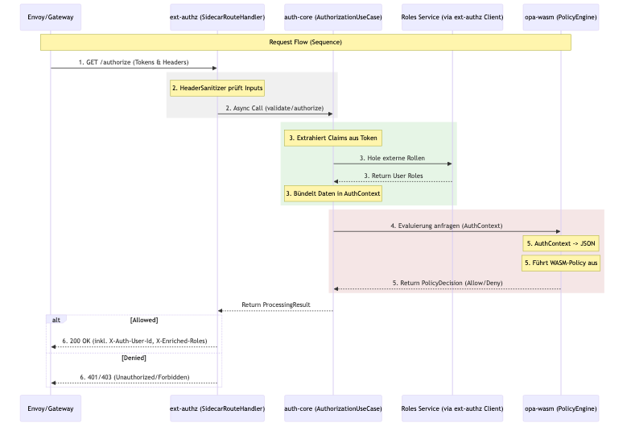

# AuthN/AuthZ Sidecar - Architektur & Implementierungsplan

## Übersicht

Der **k8s-auth-sidecar** (Request Router Sidecar) ist ein Quarkus-basierter Microservice, der als Sidecar in einem Kubernetes-Pod läuft und Authentifizierung (AuthN) sowie Autorisierung (AuthZ) für den Haupt-Container übernimmt.

## Architekturdiagramm (ASCII)


## Request Flow



## Module & Komponenten (Maven Multi-Module)

Die gesamte HTTP-Pipeline ist reaktiv implementiert (`Mutiny Uni`), was höchste Parallelität bei minimalem Ressourcenverbrauch garantiert.

## Betriebsmodi

### 1. Streaming Proxy Mode (Sidecar)
In diesem Modus ist der Sidecar der einzige Einstiegspunkt für den App-Container.
- **Entry**: `AuthProxyFilter` fängt alle Requests an `/**` ab.
- **Routing**: `SidecarRouteHandler` entscheidet reaktiv zwischen Proxy-Flow und lokalen Endpunkten.
- **Proxy**: `HttpProxyService` streamt den Request an `localhost:$PROXY_TARGET_PORT`.

### 2. Gateway Mode (ext_authz)
In diesem Modus wird der Sidecar von einem externen Loadbalancer/Gateway aufgerufen.
- **Endpoint**: `GET /authorize`.
- **Logic**: Der Sidecar wertet die Header `X-Forwarded-Uri` und `X-Forwarded-Method` aus.
- **Response**: `200 OK` delegiert die Anfrage an das eigentliche Ziel weiter (durch das Gateway). Rollen-Enrichment erfolgt über Antwort-Header.

## Architektur für lokale Entwicklung (Dev-Profil & Mocking)

Für eine erstklassige Developer Experience ohne externe Abhängigkeiten nutzt der Sidecar im Quarkus `%dev` Profil ein dediziertes Setup:
- **WireMock-Integration**: Zwei vorkonfigurierte WireMock-Instanzen (`docker-compose.dev.yml`) simulieren den Identity Provider (OIDC Discovery, JWKS, Token-Generierung) und den externen Roles-Service (dynamische Response-Templates).
- **In-Memory Alternative**: Für reine Code-Tests ohne Container kann ein `@IfBuildProfile("dev")`-getaggter Client (`InMemoryRolesService`) als Fallback einkompiliert werden.
- **Auto-Config**: Im `%dev`-Modus werden Caches für Roles und Policies deaktiviert, um sofortige Testrückmeldungen (Live-Reloading) zu ermöglichen.

## Technologie-Stack

| Komponente | Technologie |
|------------|-------------|
| Runtime | Quarkus 3.x (Native Image Support) |
| Language | Java 21 |
| OIDC | quarkus-oidc |
| HTTP Client | quarkus-rest-client-reactive |
| Policy Engine | OPA WASM (Chicory) oder REST (external) |
| Metrics | Micrometer + Prometheus |
| Logging | quarkus-logging-json |
| Container | GraalVM Native Image |
| Orchestration | Kubernetes Sidecar Pattern |

## Konfiguration

### Umgebungsvariablen

```bash
# Identity Provider
OIDC_AUTH_SERVER_URL=https://keycloak.example.com/realms/myrealm
OIDC_CLIENT_ID=my-client
OIDC_TENANT_ENABLED=true

# Microsoft Entra ID (optional, multi-tenant)
ENTRA_AUTH_SERVER_URL=https://login.microsoftonline.com/{tenant}/v2.0
ENTRA_CLIENT_ID=azure-client-id

# Roles Microservice
ROLES_SERVICE_URL=http://roles-service:8080
ROLES_SERVICE_PATH=/api/v1/users/{userId}/roles

# Proxy Target
PROXY_TARGET_HOST=localhost
PROXY_TARGET_PORT=8081

# OPA
OPA_MODE=embedded
OPA_WASM_PATH=/policies/authz.wasm
OPA_DECISION_ENDPOINT=/v1/data/authz/allow

# Metrics & Logging
QUARKUS_LOG_LEVEL=INFO
QUARKUS_METRICS_ENABLED=true
```

## Policy-Beispiel (Rego)

```rego
package authz

default allow = false

# Erlaubt Zugriff wenn User die benötigte Rolle hat
allow {
    required_role := role_mapping[input.request.path][input.request.method]
    required_role == input.user.roles[_]
}

# Mapping von Pfaden zu benötigten Rollen
role_mapping := {
    "/api/admin": {"GET": "admin", "POST": "admin"},
    "/api/users": {"GET": "user", "POST": "admin"},
    "/api/public": {"GET": "public"}
}

# Erlaubt Zugriff für superadmin
allow {
    input.user.roles[_] == "superadmin"
}
```

## Deployment

### Sidecar-Pattern in Kubernetes

```yaml
spec:
  containers:
    # Main Application Container
    - name: application
      image: my-app:latest
      ports:
        - containerPort: 8081
    
    # Sidecar Container (AuthN/AuthZ)
    - name: k8s-auth-sidecar
      image: space.maatini/k8s-auth-sidecar:latest
      ports:
        - containerPort: 8080
      env:
        - name: PROXY_TARGET_HOST
          value: "localhost"
        - name: PROXY_TARGET_PORT
          value: "8081"
```

## 🧪 Implementierungsplan & Testing-Strategie

> [!IMPORTANT]
> **Qualität zuerst:** Für uns ist Testing kein lästiges Extra, sondern der Kern unserer Stabilität. Wir nutzen modernste Java-Techniken wie **PIT Mutation Testing**, um sicherzustellen, dass unsere Tests wirklich jeden Fehler finden.

### Unsere Metriken (Stand März 2026)
- **142 automatisierte Tests** (JVM + Native)
- **PIT Test Strength > 70%** (unser Gold-Standard für Qualität)
- **PIT Line Coverage > 75%**

Weitere Details zum Testen findest du in unserem **legendären Testing-Abschnitt** im [README.md](../README.md#🧪-so-testest-du-das-projekt-–-schritt-für-schritt-super-einfach-erklärt).

---

## 🛡️ Sicherheitsaspekte

- **Zero-Trust**: Jede Anfrage wird strikt validiert. Vertrauen ist gut, Kontrolle ist besser!
- **Streaming Proxy**: Schützt vor Out-of-Memory-Attacken bei riesigen Uploads.
- **Secure Defaults**: Alles ist standardmäßig verboten (`Deny by default`).
- **WASM Hot-Reload**: Policies können im laufenden Betrieb ohne Neustart aktualisiert werden.

---

Dieses Dokument wird stetig erweitert. Bei Fragen wende dich an die Architektur-Gurus! 🚀

---

## ⚡ Performance & Production Readiness (Roadmap)

> [!NOTE]
> Das Projekt hat **POC-Reife** erreicht (alle Kernfeatures funktional, Demo in < 3 Minuten lauffähig). Für Production-Deployments mit **> 1000 RPS** wurden in Lasttests die folgenden Flaschenhälse identifiziert. Die Architektur ist bereits auf deren Beseitigung ausgelegt.

### Identifizierte Bottlenecks & geplante Lösungen

| # | Bottleneck | Ursache | Geplante Lösung |
|---|-----------|---------|-----------------|
| 1 | **Event-Loop CPU-Blockade** | `WasmPolicyEngine` ruft `Jackson ObjectMapper` & Styra WASM-Engine synchron auf dem Vert.x Event Loop auf. Blockiert alle parallelen Requests auf demselben Thread. | Offloading auf den Quarkus Worker-Pool via `@Blocking` oder `Uni.emitOn(Infrastructure.getDefaultWorkerPool())`. |
| 2 | **Connection Pool Limit** | `HttpProxyService` nutzt einen HTTP-Connection-Pool mit Default-`pool-size` = 100. Bei > 100 gleichzeitigen In-Flight Requests staut sich die Queue (Little's Law). | Für Prod: `quarkus.rest-client.pool-size` und `io.vertx.core.http.poolSize` auf Last prüfen und dynamisch erhöhen. |
| 3 | **Synchrones JSON-Logging** | `quarkus-logging-json` schreibt Logs synchron auf dem Event-Loop – bei hohem Log-Volume addiert sich die I/O-Latenz. | Asynchrones Logging aktivieren: `quarkus.log.handler.console.async=true` in `application.properties`. |
| 4 | **GC-Druck durch Header-Parsing** | Header-Propagierung im Proxy nutzt `Map`-Iterationen und `Stream`-Operationen, die kurzlebige Objekte erzeugen und den GC belasten. | Umstellung auf Vert.x `MultiMap` (case-insensitive, allocation-optimiert, kein Boxing). |

### POC vs. Production

| Dimension | POC (aktuell) | Production (Ziel) |
|-----------|--------------|-------------------|
| Durchsatz | < 100 RPS (Showcase) | > 1000 RPS |
| Event-Loop-Safety | Sync WASM-Eval | Worker-Pool Offloading |
| Connection Pool | Default 100 | Lastabhängig konfiguriert |
| Logging | Synchron | Asynchron |
| Header-Handling | Stream/Map | Vert.x MultiMap |

> [!IMPORTANT]
> Für den **POC** sind alle oben genannten Punkte bewusst zurückgestellt – Korrektheit und Stabilität der Auth-Pipeline haben Vorrang. Die Architektur ist modular genug, um diese Optimierungen schrittweise einzuführen, ohne die Domain-Logik anzufassen.
